# TaskProgressionSwarm

**Plantilla de trabajo con agentes: un swarm ejecuta, un revisor audita, la nota realimenta.**

Un sistema operativo para agentes de IA construido solo con Markdown y git. No hay código que compilar ni dependencias que instalar: copias la plantilla a tu proyecto, rellenas los huecos, y tienes un bucle de trabajo → revisión → recompensa funcionando en 10 minutos.

> Extraída de un sistema real que evolucionó de nota **8 a 10 en 6 entregas**. Cada rol tiene su carpeta, cada documento su dueño.

---

## La idea en una frase

> Un algoritmo swarm hace las tareas, un agente revisor independiente las audita contra la realidad, y la nota que emite alimenta el aprendizaje del swarm.

## El bucle

```
TODO.md ──> boot (owner/boot_swarm.md) ──> swarm (custom_agent.md + NOTA-AGENTE.md)
   │                                              │
   │                                              └──> agents/reports/informe-*.md + commits
   │                                                        │
   └── propietario pide revisión ───────────────────────────┴──> revisor (REVISOR.md)
                                                                      │
                                                                      ├──> nota 1-10 (recompensa)
                                                                      └──> actualiza NOTA-AGENTE.md + TODO.md + REVISOR.md
```



```mermaid
sequenceDiagram
    autonumber
    actor P as 👤 Propietario
    participant S as 🐝 Swarm
    participant R as 📦 Repo (git + TODO.md)
    participant V as 🔍 Revisor

    rect rgb(14, 26, 19)
        Note over P,S: FASE 1 — Boot (systemd-style)
        P->>S: carga boot_swarm.md (inicio de cualquier tarea)
        S->>S: lee AGENTS.md → CONTEXTO.md → TODO.md → protocolo → NOTA-AGENTE.md
        S->>R: git status + git log (¿árbol limpio?)
        S->>P: "¿qué tarea quieres?" (menú de TODO.md con coste estimado)
        P->>S: elige tarea (nunca elige el swarm por él)
    end

    rect rgb(22, 30, 40)
        Note over S,R: FASE 2 — Trabajo del swarm
        S->>S: plan escrito + test de completitud de scope
        loop Por cada fase
            S->>R: commits pequeños y atómicos
            S->>S: verificación (CHECK_CMD + BUILD_CMD)
        end
        S->>R: informe de 8 secciones → agents/reports/ (último commit)
        S->>R: actualiza TODO.md (tarea cerrada)
    end

    rect rgb(19, 26, 38)
        Note over P,V: FASE 3 — Revisión
        P->>V: "revísalo" / "dale nota"
        V->>R: lee informe-*.md (¿8 secciones? ¿commiteado?)
        V->>R: diffea commits uno a uno
        V->>R: contrasta datos con la fuente de verdad + frescura
        V->>R: verificación independiente (CHECK_CMD + BUILD_CMD)
        V->>P: nota 1-10 con desglose (qué sumó, qué restó)
    end

    rect rgb(26, 23, 12)
        Note over V,S: FASE 4 — Realimentación (cierra el bucle)
        V->>R: actualiza NOTA-AGENTE.md (feedback de evolución)
        V->>R: actualiza TODO.md (deudas como tareas) + CONTEXTO.md + REVISOR.md
        Note over S: en el próximo boot, el swarm lee NOTA-AGENTE.md<br/>y aplica el feedback → el bucle se repite
    end
```

El repositorio git es la memoria compartida y el canal de comunicación entre agentes. **Si no está escrito en un archivo, no existe.**

---

## Los tres roles

### 🐝 El swarm — trabajo
Ejecuta las tareas declaradas en `TODO.md`. Trabaja según su protocolo (`agents/swarm/custom_agent.md`) y el feedback vigente del revisor (`agents/swarm/NOTA-AGENTE.md`). Cada entrega termina con un **informe de 8 secciones** commiteado como último commit.

### 🔍 El revisor — verificación
Agente evaluador **independiente** que diffea los commits uno a uno, contrasta cada afirmación contra la fuente de verdad, recalcula a mano, ejecuta él mismo los checks sin fiarse del informe, y emite una **nota del 1 al 10** con desglose. No es orquestador: *"juez y parte corrompería la señal"*.

### 👤 El propietario — orquestación
Humano que decide qué tarea se hace, aprueba cambios en los protocolos y usa la nota como recompensa para la evolución del sistema.

**Regla de oro:** el evaluado jamás reescribe sus propias reglas. Los cambios a los protocolos se proponen, el revisor los aplica tras aprobación del propietario.

---

## Estructura

```
├── README.md                      <- este archivo (instrucciones de montaje)
├── TODO.md                        <- estado del proyecto: hecho / pendiente / ideas
├── AGENTS.md                      <- memoria del proyecto (gotchas, geografía, pipeline)
├── CONTEXTO.md                    <- decisiones finas que no caben en AGENTS.md
├── .gitignore
└── agents/
    ├── README.md                  <- mapa de roles + diagrama del bucle
    ├── owner/boot_swarm.md        <- arranque automático del swarm (systemd-style)
    ├── swarm/custom_agent.md      <- protocolo de trabajo del swarm
    ├── swarm/NOTA-AGENTE.md       <- feedback de evolución (lo escribe el revisor)
    ├── revisor/REVISOR.md         <- protocolo y memoria del evaluador
    └── reports/                   <- informes de entrega del swarm (uno por tarea)
```

`TODO.md`, `AGENTS.md` y `CONTEXTO.md` son **memoria compartida del proyecto**: los leen ambos roles y los humanos. Los nombres de archivo de los roles no se cambian sin avisar — el swarm puede tener punteros duros a ellos.

---

## Montaje en un proyecto nuevo (10 minutos)

### ⚡ Opción asistida — el camino recomendado

Carga `agents/revisor/first_boot_revisor_builder.md` en tu agente revisor. Te entrevistará por bloques (identidad, stack, fuente de datos, zonas prohibidas, tareas), rellenará la plantilla con tus respuestas, verificará que quedan **0 placeholders** y commiteará. Tú solo respondes preguntas.

### Opción manual

1. **Copia el contenido de esta carpeta a la raíz de tu proyecto** (no como subcarpeta: `TODO.md` y `AGENTS.md` deben estar en la raíz).
2. **Sustituye los `{{PLACEHOLDER}}`** en todos los `.md` — búscalos con `Select-String "{{" -Path *.md -Recurse`. Los principales:

   | Placeholder | Qué es |
   |---|---|
   | `{{PROJECT_NAME}}` | nombre del proyecto |
   | `{{PKG_MANAGER}}` | gestor de paquetes (bun/npm/pnpm/cargo/pip…) |
   | `{{CHECK_CMD}}` | comando de verificación estática (tsc, svelte-check, clippy…) |
   | `{{BUILD_CMD}}` | comando de build |
   | `{{DATA_SOURCE}}` | tu fuente de verdad de datos (API, BD, dumps, ficheros…) |
   | `{{REPORT_PATH}}` | dónde viven los informes (`agents/reports/` por defecto) |

3. **Rellena `TODO.md`** con tus tareas reales (hecho/pendiente). El swarm SOLO trabaja tareas que estén ahí.
4. **Rellena `AGENTS.md`** con lo que ya sabes del proyecto — cada gotcha que escribas es una hora que tu swarm no perderá redescubriéndolo.
5. **Inicializa git y haz el primer commit.** El sistema necesita commits pequeños: la revisión y el revert dependen de ello.
6. **Ejecuta el boot**: carga `agents/owner/boot_swarm.md` en tu swarm al iniciar cualquier tarea. El swarm preguntará qué tarea se quiere (nunca elige por ti), trabajará según el protocolo y entregará informe en `agents/reports/`.
7. **Pide la revisión** a tu agente revisor cargando `agents/revisor/REVISOR.md`. La nota 1-10 es tu recompensa para el aprendizaje del swarm.

---

## Los 5 principios que hacen funcionar el sistema

1. **Fuente de verdad explícita** — todo dato debe poder rastrearse a su origen. Nada inventado, nada "aproximado". Un 90% auditable vale más que un 100% con un dato falso.
2. **Texto/datos viajan por pipeline** — si el dato viene de una fuente externa, existe un script que lo extrae y genera código. Los datos a mano mueren con el primer patch.
3. **Informe obligatorio a archivo** — el swarm escribe un informe de 8 secciones y lo commitea. Sin informe, la entrega está incompleta. Es lo que hace la revisión posible.
4. **Separación de capas** — aprendizaje (`NOTA-AGENTE.md`, cambia cada entrega) ≠ contrato (`custom_agent.md`, solo cambia por propuesta aprobada) ≠ memoria del proyecto (`AGENTS.md`). El evaluado jamás reescribe sus propias reglas.
5. **Commits pequeños y atómicos** — la revisión diffea paso a paso y los errores se revierten con precisión quirúrgica.

---

## El barómetro de notas

La nota del revisor lleva desglose: qué sumó, qué restó y por qué. Referencia orientativa:

| Nota | Significado |
|---|---|
| **≤7** | Rechazo: datos inventados, informe ausente o regla dura violada |
| **8** | Trabajo sólido con 1 bug de datos o proceso, sin gravedad |
| **9** | Trazabilidad ejemplar, 1-2 deudas menores declaradas |
| **9.5** | Todo lo anterior + deudas previas saldadas + algo extra de valor real |
| **10** | Trazabilidad total + decisiones de datos justificadas |

**Regla del sistema:** un 90% correcto y auditable vale más que un 100% con un dato inventado.

---

## Lecciones aprendidas en el sistema original

Léelas antes de modificar nada:

- El crash más tonto (un `m[3]` de un regex de 2 grupos) lo detectó el **swarm**, no el humano ni el revisor: la doble verificación funciona en ambas direcciones.
- Un dato "stale" (fuente más nueva que el dato generado) es un bug silencioso: la frescura se comprueba siempre.
- El feedback de evolución (`NOTA-AGENTE.md`) es **infraestructura**: si se borra, el bucle muere. Restaurarlo es lo primero.
- Los tests del propietario (texto oculto, commits anómalos) son legítimos; el protocolo del revisor los trata igual que una amenaza real hasta que el propietario confirma.
- El revisor también mete bugs: ante un mismatch masivo, sospecha primero de tu script de verificación, luego del dato.

---

## Preguntas frecuentes

**¿Esto es RLHF?** Se parece en el esqueleto (generar → evaluar → recompensar → ajustar), pero no hay gradiente ni pesos: el aprendizaje es simbólico y vive en archivos Markdown. Evoluciona el protocolo, no el modelo.

**¿Funciona con cualquier agente?** Está pensado para cualquier sistema de agentes con acceso al repo: swarms, Claude, Copilot u otros. Para todos los efectos, el swarm se trata como UN agente.

**¿Por qué Markdown y git?** Porque son auditables por definición: cada cambio rastreable, cada decisión documentada, cada entrega revertible. El revisor no ve al swarm trabajar — solo ve el repo.

---

*Si vas a modificar los protocolos, lee primero las lecciones aprendidas. Un gotcha escrito = una hora ahorrada.*
